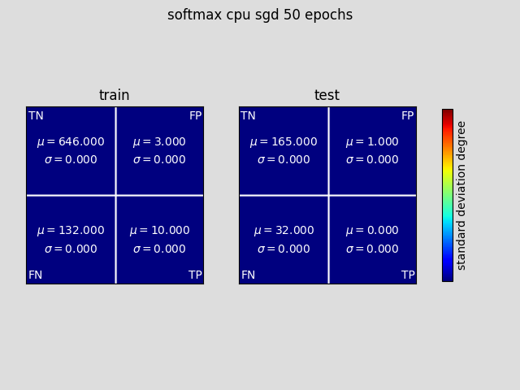
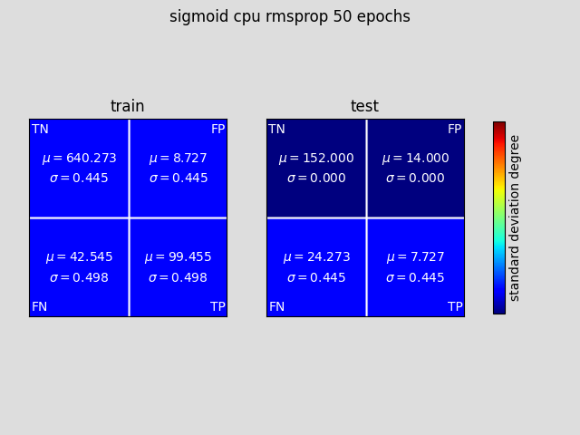
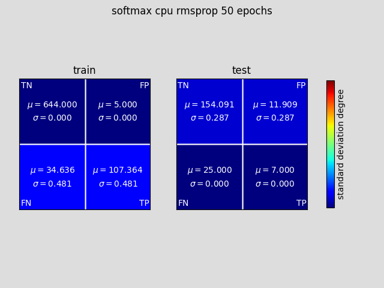
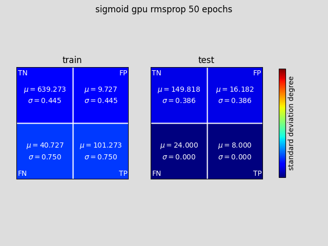
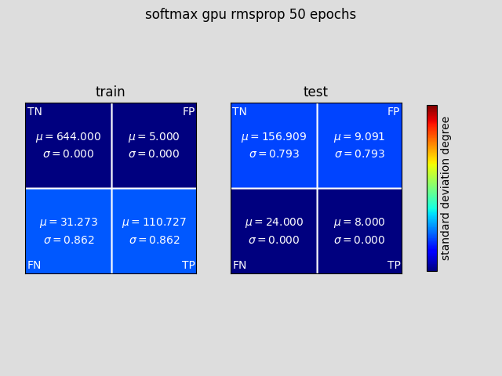
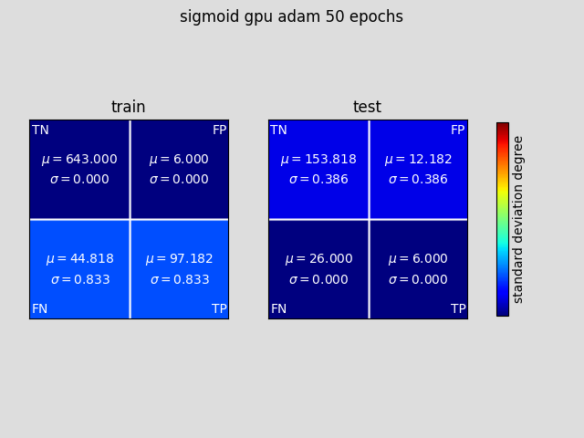
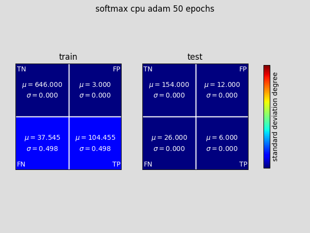
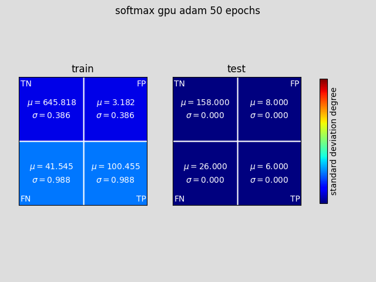
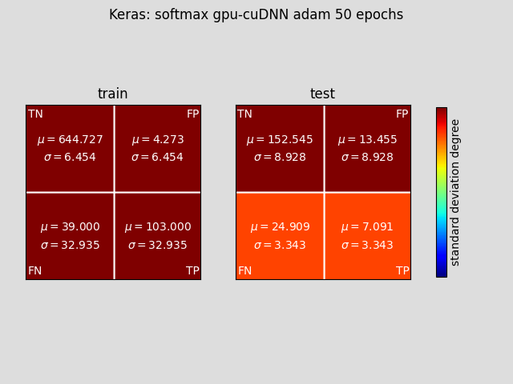
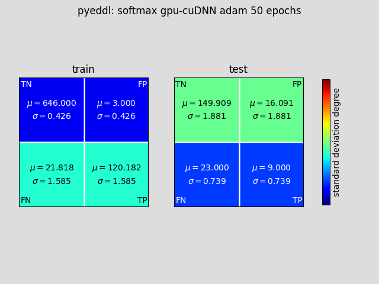

# ISSUE 294

Different results of recurrent GRU network during different executions [Issue 294](https://github.com/deephealthproject/eddl/issues/294)

Here you can find C++ and Python code used to check the issue.
We were not able to reproduce the behaviour reported.
The different report files at [logs](logs) contain the result
of different runs with the C++ and Python code.
Additionally, the same topology has been tested using TensorFlow+Keras.

*C++* version was checked with the develop branch at 2020-07-01.
*Python* version was checked with _pyeddl_ version 1.0.0 and _eddl_ version 1.0.92a

This folder also contains:

- [here](data) the sample data provided by Wings to help us solve [*Issue 294*](https://github.com/deephealthproject/eddl/issues/294),

- [here](python) a sample Python code with the same basic topology tested with _TensorFlow+Keras_ and to extract the sample data to the binary tensor format of the *EDDL*, and 

- [here](scripts) some useful scripts to run the compile C++ code.

Findings:

- Discrepancies using GRU in the results obtained with *eddl*, *pyeddl-cuDNN* and *Keras*.

These discrepancies are normal depending on the optimizer used.
_Adam_ and _RMSprop_ optimizers use element-wise divisions that raise to differences due to lack of precision in some computations.
This can be seen in the following results presented in confusion matrix plots, one per tested configuration.

In order to mitigate the effect, we increased the parameter _epsilon_ of the optimizers whose default value is 1.0e-8.
The value used in all the experiments using the C++ version was 1.0e-3, the differences are attenuated at the cost of delaying the convergence to the desired accuracy.

- All the plots have been obtained by creating a new net from scratch per configuration, and then repeating
  10 runs with the same weight initialization. In total 11 runs per configuration.

- Concerning the use of _BatchNormalization_, the behaviour observed is correct.
However, in order to avoid too much differences when using _BatchNormalization_
it is important to use a *batch_size* larger than 30 samples, in all the experiments presented here it was 50.
Another important detail to consider is to run a minimum of epochs to ensure the global mean and variance 
computed in _BatchNormalization_ layers is representative, all the results presented here each run lasted for 50 epochs.

## Next figures provide an overview of the differences found for all the configurations tested.

No differences when using optimizer *SGD*

 

Insignificant differences when using optimizer *RMSprop* with *epsilon* set to 1.e-3

 

Insignificant differences when using optimizer *Adam* with *epsilon* set to 1.e-3

 

Relevant differences when using optimizer *Adam* with default value of *epsilon* in Keras and pyeddl-cuDNN

